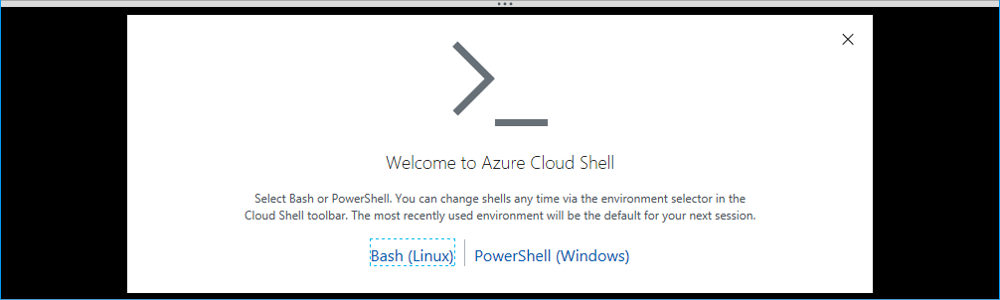
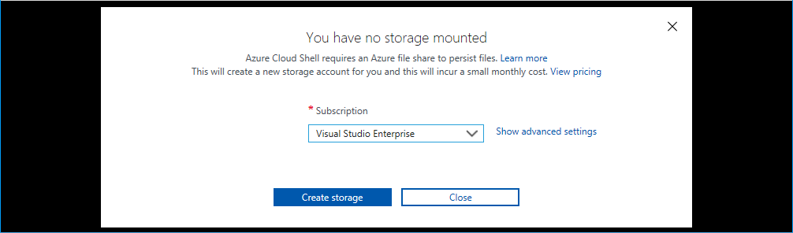
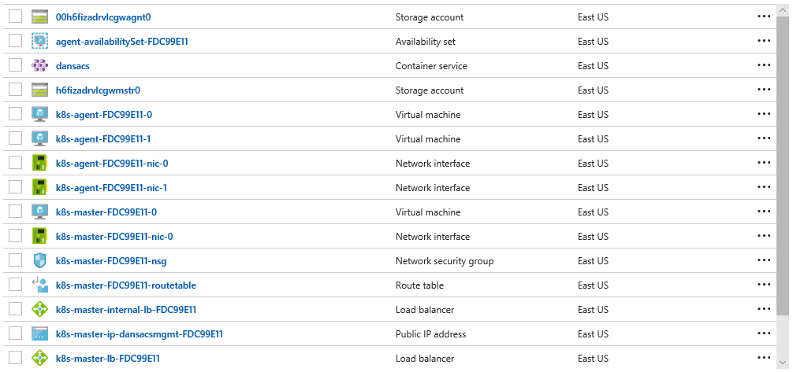

# Containerize Your World using Azure Container Services

This session will show you how to get started with Azure Container Service (ACS), one of the most powerful ways of running containerized applications in Azure. You'll learn how to set up a Kubernetes cluster using the Azure Cloud Shell and deploy a highly available and scalable web application with only a few commands. We'll then show how easy it is to scale up, reconfigure or update your application without any incurring any downtime to users.

## Content

- [Part 1 - Opening a Cloud Shell](#part-1---opening-a-cloud-shell)
- [Part 2 - Create an Azure Container Service](#part-2---create-the-azure-container-service)
- [Part 3 - Run Your First Container](#part-3---run-your-first-container)

## Part 1 - Opening a Cloud Shell

Azure Cloud Shell is an interactive, browser-accessible shell for managing Azure resources. It provides the flexibility of choosing the shell experience that best suits the way you work. Linux users can opt for a Bash experience, while Windows users can opt for PowerShell.

1. Open Cloud Shell by clicking the Cloud Shell icon:
   

> If you have **not** previously used Azure Cloud Shell:



1. Click **Bash (Linux)**

   _When you first create a Cloud Shell a storage account will get created for you to store your settings, scripts and other files you might create. This enables you to have access to your
   own environment no matter what device you're using._

   

1. Select the **subscription** to create the Storage Account in and click
   **Create storage**.
1. The Storage Account will be created and the Cloud Shell will be started:

   

> If you have previously used Azure Cloud Shell:

1. Select **Bash** from the shell drop down:

   

## Part 2 - Create an Azure Container Service

We will now use the Cloud Shell to create a new Azure Container Service (ACS) Kubernetes cluster that will be used to host our containers.

Any ACS service you create will be publically accessible on the internet.
A URL will be automatically assigned to your ACS service that you will be
able to use to access your containers and manage your cluster.

1. Come up with a **name** for your ACS service. The name must contain only letters and numbers and be globally unique because it will be used for the public URLs of your Kubernetes cluster.

1. Run this command in Cloud Shell, but change 'dsracs' to the **name** that you specified above.

   ```bash
   name="dansacs"
   ```

1. Run this command your Cloud Shell to create a resource group:

   ```bash
   az group create --name $name-rgp --location EastUS
   ```

1. Run this command in Cloud Shell to create a Kubernetes cluster:

   ```bash
   az acs create --name $name --resource-group $name-rgp --location EastUS --dns-prefix $name --orchestrator-type kubernetes --generate-ssh-keys --agent-count 2
   ```

The ACS Kubernetes cluster will be created in your Azure subscription.
This will take at least 10 minutes to complete creation of the ACS.


Once the Kubernetes cluster has been created we can continue with the workshop.

In the meantime, we'll talk about what containers are and how they're used as well as talking about the components that make up a Kubernetes cluster.

## Part 3 - Run Your First Container

Once your ACS has been created you will be able to review the resources that have
been created:


