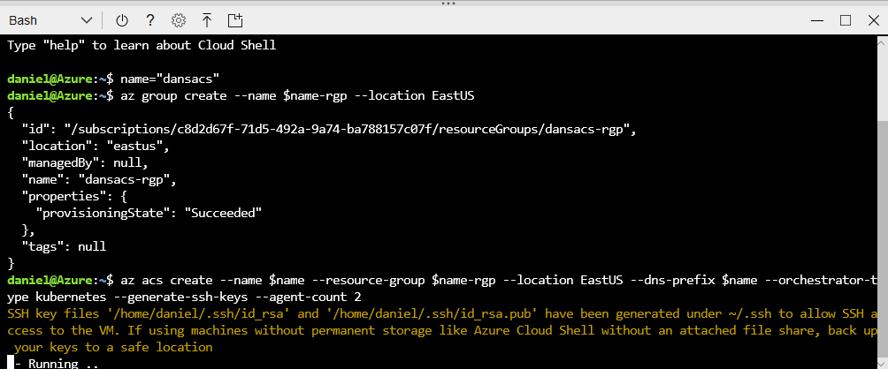

# Containerize Your World using Azure Container Services

This session will show you how to get started with Azure Container Service (ACS), one of the most powerful ways of running containerized applications in Azure. You'll learn how to set up a Kubernetes cluster using the Azure Cloud Shell and deploy a highly available and scalable web application with only a few commands. We'll then show how easy it is to scale up, reconfigure or update your application without any incurring any downtime to users.

## Content

- [Part 1 - Opening a Cloud Shell](#part-1---opening-a-cloud-shell) - 5 min
- [Part 2 - Create an Azure Container Service](#part-2---create-the-azure-container-service) - 5 min
- [Introduction to Containers, Docker and Kubernetes](#introduction-to-containers,-docker-and-kubernetes) - 30 min
- [Part 3 - Manage Cluster with Cloud Shell](#part-3---manage-cluster-with-cloud-shell) - 5 min

- [Part X - Delete the Cluster](#part-x---delete-the-cluster) - 5 min

## Part 1 - Opening a Cloud Shell

Azure Cloud Shell is an interactive, browser-accessible shell for managing Azure resources. It provides the flexibility of choosing the shell experience that best suits the way you work. Linux users can opt for a Bash experience, while Windows users can opt for PowerShell.

1. Open Cloud Shell by clicking the Cloud Shell icon:
   

> If you have **not** previously used Azure Cloud Shell:


1. Click **Bash (Linux)**

   _When you first create a Cloud Shell a storage account will get created for you to store your settings, scripts and other files you might create. This enables you to have access to your
   own environment no matter what device you're using._

   

1. Select the **subscription** to create the Storage Account in and click
   **Create storage**.
1. The Storage Account will be created and the Cloud Shell will be started:

   

> If you have previously used Azure Cloud Shell:

1. Select **Bash** from the shell drop down:

   

## Part 2 - Create an Azure Container Service

We will now use the Cloud Shell to create a new Azure Container Service (ACS) Kubernetes cluster that will be used to host our containers.

Any ACS service you create will be publically accessible on the internet.
A URL will be automatically assigned to your ACS service that you will be
able to use to access your containers and manage your cluster.

1. Come up with a **name** for your ACS service. The name must contain only letters and numbers and be globally unique because it will be used for the public URLs of your Kubernetes cluster.

1. Run this command in Cloud Shell, but change 'dsracs' to the **name** that you specified above.

   ```bash
   name="dansacs"
   ```

1. Run this command your Cloud Shell to create a resource group:

   ```bash
   az group create --name $name-rgp --location EastUS
   ```

1. Run this command in Cloud Shell to create a Kubernetes cluster:

   ```bash
   az acs create --name $name --resource-group $name-rgp --location EastUS --dns-prefix $name --orchestrator-type kubernetes --generate-ssh-keys --agent-count 2
   ```

The ACS Kubernetes cluster will be created in your Azure subscription.
This will take at least 10 minutes to complete creation of the ACS.



## Introduction to Containers, Docker and Kubernetes

Once the Kubernetes cluster has been created we can continue with the workshop.

In the meantime, we'll talk about what containers are and how they're used as well as talking about the components that make up a Kubernetes cluster.

## Part 3 - Manage Cluster with Cloud Shell

Once your ACS has been created you will be able to review the resources that have been created:


Now that our cluster is deployed we need to configure Cloud Shell to be able
to manage it.

Kubernetes clusters always expose a management endpoint that the Kubernetes tools
and other software can use to control and monitor the cluster with. The FQDN
for this endpoint can be located by selecting the ACS cluster resource in the
resource group that we deployed to contain our cluster:


We can then configure the `kubectl` tool to manage this cluster. We could do this
manually, but the `Azure CLI` in Cloud Shell provides a handy way to do this for us.

1. Configure your Cloud Shell to manage your ACS by running the command:

   ```bash
   az acs kubernetes get-credentials --resource-group $name-rgp --name $name
   ```

   

2. Validate our cluster is running by running the command:

   ```bash
   kubectl cluster-info
   ```

   

3. Check all nodes in the cluster by running the command:

   ```bash
   kubectl get nodes
   ```

## Step X - Delete the Cluster

> This step is optional and only needs to be done if you're finished with your
> cluster and want to get rid of it to save some Azure credit.

_Note: If you just want to pause running your cluster, you can actually go in and
shut each of the cluster VMs down. This will reduce some compute costs but won't
completely delete the cluster. You will still pay for some components._

1. Delete the cluster by running the following command in the Azure Cloud Shell:

   ```bash
   az acs delete --resource-group $name-rgp --name $name --yes
   ```

2. Delete the resource group by running this command in the Azure Cloud Shell:

   ```bash
   az group delete --name $name-rgp --yes
   ```


Everything will now be cleaned up and deleted and you won't be paying to run
an ACS Kubernetes cluster.
