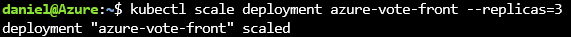
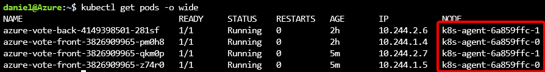
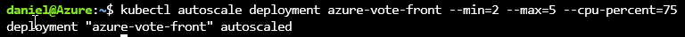
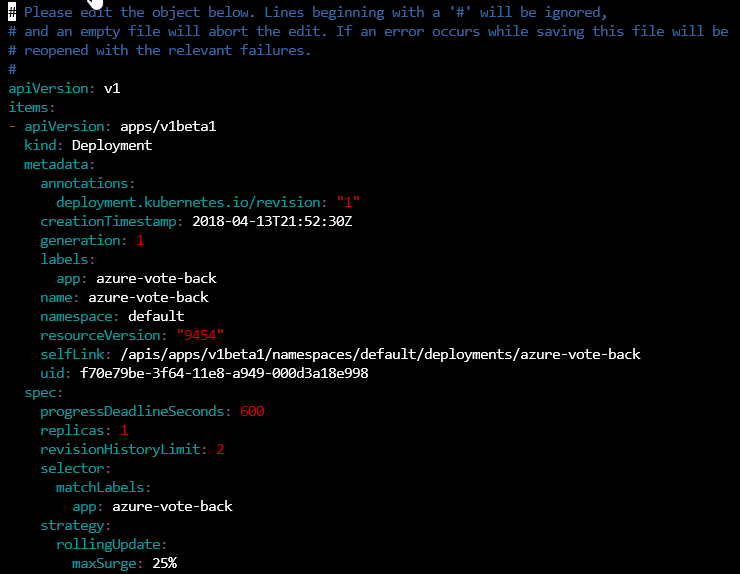
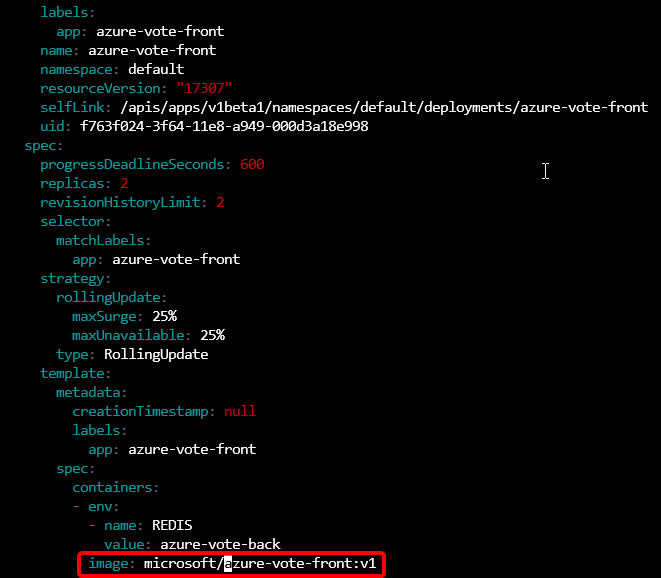
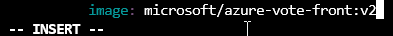
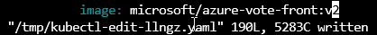
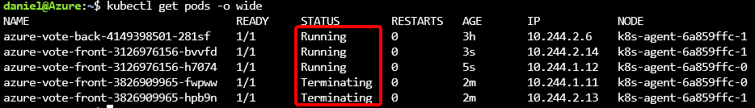
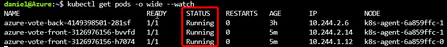
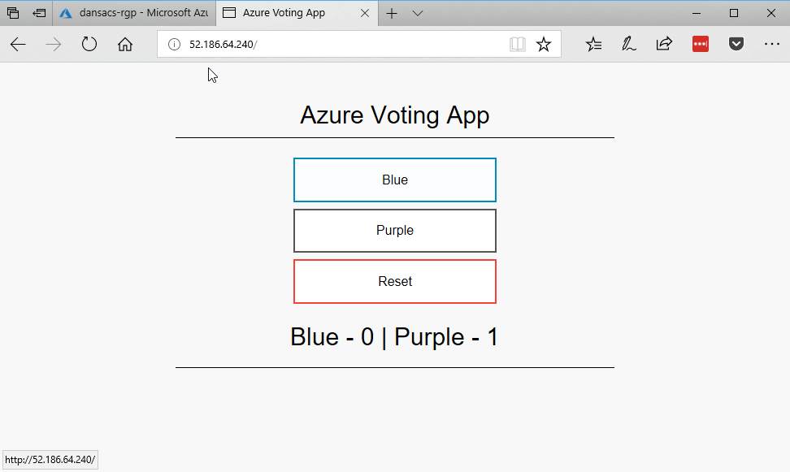

# Containerize Your World using Azure Container Services

This session will show you how to get started with Azure Container Service (ACS), one of the most powerful ways of running containerized applications in Azure. You'll learn how to set up a Kubernetes cluster using the Azure Cloud Shell and deploy a highly available and scalable web application with only a few commands. We'll then show how easy it is to scale up, reconfigure or update your application without any incurring any downtime to users.

## Content

- [Part 1 - Opening a Cloud Shell](#part-1---opening-a-cloud-shell) - 5 min
- [Part 2 - Create an Azure Container Service](#part-2---create-the-azure-container-service) - 5 min
- [Introduction to Containers, Docker and Kubernetes](#introduction-to-containers,-docker-and-kubernetes) - 30 min
- [Part 3 - Manage Cluster with Cloud Shell](#part-3---manage-cluster-with-cloud-shell) - 5 min
- [Part 4 - Deploy your First Application](#part-4---deploy-your-first-application) - 10 min
- [Part 5 - Scale out your First Application](#part-5---scale-out-your-first-application) - 10 min

- [Part X - Delete the Cluster](#part-x---delete-the-cluster) - 5 min

## Part 1 - Opening a Cloud Shell

Azure Cloud Shell is an interactive, browser-accessible shell for managing Azure resources. It provides the flexibility of choosing the shell experience that best suits the way you work. Linux users can opt for a Bash experience, while Windows users can opt for PowerShell.

1. Open Cloud Shell by clicking the Cloud Shell icon:
   

> If you have **not** previously used Azure Cloud Shell:


1. Click **Bash (Linux)**

   _When you first create a Cloud Shell a storage account will get created for you to store your settings, scripts and other files you might create. This enables you to have access to your
   own environment no matter what device you're using._

   

1. Select the **subscription** to create the Storage Account in and click
   **Create storage**.
1. The Storage Account will be created and the Cloud Shell will be started:

   

> If you have previously used Azure Cloud Shell:

1. Select **Bash** from the shell drop down:

   

## Part 2 - Create an Azure Container Service

We will now use the Cloud Shell to create a new Azure Container Service (ACS) Kubernetes cluster that will be used to host our containers.

Any ACS service you create will be publically accessible on the internet.
A URL will be automatically assigned to your ACS service that you will be
able to use to access your containers and manage your cluster.

1. Come up with a **name** for your ACS service. The name must contain only letters and numbers and be globally unique because it will be used for the public URLs of your Kubernetes cluster.

1. Run this command in Cloud Shell, but change 'dsracs' to the **name** that you specified above.

   ```bash
   name="dansacs"
   ```

1. Run this command your Cloud Shell to create a resource group:

   ```bash
   az group create --name $name-rgp --location EastUS
   ```

1. Run this command in Cloud Shell to create a Kubernetes cluster:

   ```bash
   az acs create --name $name --resource-group $name-rgp --location EastUS --dns-prefix $name --orchestrator-type kubernetes --generate-ssh-keys --agent-count 2
   ```

The ACS Kubernetes cluster will be created in your Azure subscription.
This will take at least 10 minutes to complete creation of the ACS.


## Introduction to Containers, Docker and Kubernetes

Once the Kubernetes cluster has been created we can continue with the workshop.

In the meantime, we'll talk about what containers are and how they're used as well as talking about the components that make up a Kubernetes cluster.

## Part 3 - Manage Cluster with Cloud Shell

Once your ACS has been created you will be able to review the resources that have been created:


Now that our cluster is deployed we need to configure Cloud Shell to be able
to manage it.

Kubernetes clusters always expose a management endpoint that the Kubernetes tools
and other software can use to control and monitor the cluster with. The FQDN
for this endpoint can be located by selecting the ACS cluster resource in the
resource group that we deployed to contain our cluster:


We can then configure the `kubectl` tool to manage this cluster. We could do this
manually, but the `Azure CLI` in Cloud Shell provides a handy way to do this for us.

1. Configure your Cloud Shell to manage your ACS by running the command:

   ```bash
   az acs kubernetes get-credentials --resource-group $name-rgp --name $name
   ```

   

1. Validate our cluster is running by running the command:

   ```bash
   kubectl cluster-info
   ```

   

1. Check all nodes in the cluster by running the command:

   ```bash
   kubectl get nodes
   ```

## Part 4 - Deploy your First Application

1. Download a Kubernetes _Manifest_ file for the demo app to your Cloud Shell:

   ```bash
   wget https://raw.githubusercontent.com/PlagueHO/AzureGlobalBootcamp2018/master/src/azure-vote.yml
   ```

1. Create the application by telling Kubernetes to create the _Deployments_
   and _Services_ using the _Manifest_ file by running this command in the
   Cloud Shell:

   ```bash
   kubectl create -f azure-vote.yml
   ```

1. Wait for the Kubernetes _Service_ to be started and become accessible
   by running this command in the Cloud Shell:

   ```bash
   kubectl get service azure-vote-front --watch
   ```

   _This may take a few minutes for the application images to be downloaded
   to the cluster and the application to be started up. Once the external IP
   address appears then the application is up and ready for us to use:_

   

1. Once the _Service_ reports an `EXTERNAL-IP` <kbd>CTRL+C</kbd> to exit
   watching.

1. Copy the `EXTERNAL-IP` address of YOUR application into the browser and
   your app should be shown:

   

   Congratulations! You are now running your first Kubernetes application.

   

1. Now let us look at the containers deployed on the Kubernetes cluster by
   running this command in Cloud Shell:

   ```bash
   kubectl get deployments
   ```

   This shows the applications deployed to the cluster and the number of
   replicas of each container:

   

1. We can get a list of all the services running on the cluster by executing
   this command in Cloud Shell:

   ```bash
   kubectl get services
   ```

   

1. Finally, lets find out which nodes the containers are running on by
   executing this command in Cloud Shell:

   ```bash
   kubectl get pods -o wide
   ```

   

   _This command enables us to see which containers are running on each
   Kubernetes agent. Normally we wouldn't worry to much about this, but we
   want to watch what happens **later** when we shut down one of our agents._

## Part 5 - Scale up your First Application

One of the awesome features of Kubernetes and containers in general is how
easy it is to scale up (or down) our Pods so that more replicas of a
container run in it.

We can easily scale individual _Pods_ or configure autoscaling to let
Kubernetes manage the scale of indivual _Pods_ based on the load.

1. To scale the front end _Pod_ of our vote demo we can run the following
   command in our Cloud Shell:

   ```bash
   kubectl scale deployment azure-vote-front --replicas=3
   ```

   

1. Now have a look at the containers that are running on our agents
   by executing this command in Cloud Shell:

   ```bash
   kubectl get pods -o wide
   ```

   

1. Lets now set up the front end Pod to automatically scale between 2 and 5
   containers when the containers run at 75% CPU utilization by executing
   this command in our Cloud Shell:

   ```bash
   kubectl autoscale deployment azure-vote-front --min=2 --max=5 --cpu-percent=75
   ```

   

## Part 6 - Advanced Editing of a Deployment

Each _Manifest_ that has been applied to a cluster is stored within the
Cluster master as a file and can be modified to apply changes to the
_Deployments_ and _Services_ in flight.
This enables reconfiguring almost any aspect of the _Manifest_ and have
the changes applied to the _Deployments_ and _Services_ immediately.

For example, if we wanted to update the container image version of the
running containers to a new version then we could edit this file.
So, we'll now update to V2 of our running app without any user disruption
at all. This is the power of Kubernetes.

1. To edit a _Manifest_ execute the following command in Cloud Shell:

   ```bash
   kubectl edit edit -f azure-vote.yml
   ```

   

   _This will open VIM to edit the file in Azure Cloud Shell, which if you're
   not familiar with it might be a little bit tricky._

1. Search for the text `azure-vote-front:v1` in by pressing <kbd>/</kbd> on
   your keyboard and then entering `azure-vote-front:v1` and press
   <kbd>enter</kbd>. This should locate the line that matches:

   ```yaml
   image: microsoft/azure-vote-front:v1
   ```

   

1. Press <kbd>i</kbd> to enter _insert text_ mode and change the image to v2:

   ```yaml
   image: microsoft/azure-vote-front:v2
   ```

   

1. Press <kbd>esc</kbd> to exit _insert text_ mode.

1. Press <kbd>:</kbd> and then press <kbd>w</kbd> and then <kbd>enter</kbd>
   to write the file.

   

1. Press <kbd>:</kbd> and then press <kbd>q</kbd> and then <kbd>enter</kbd>
   to quit VIM.

   The changes to your Deployment will now be applied. A new version of
   the container image will be downloaded and new containers deployed using
   it. As each running container is deployed the old version will be
   terminated.

   

1. We can now watch the rolling deployment of our new application by running
   this command in the Azure Cloud Shell:

   ```bash
   kubectl get pods -o wide --watch
   ```

1. Once all Pods report a status of `Running` press <kbd>CTRL+C</kbd> to
   exit watching.

   

1. Now head back over to your running application in the browser and
   refresh the window to see the new version of your application
   running:

   

## Step X - Delete the Cluster

> This step is optional and only needs to be done if you're finished with your
> cluster and want to get rid of it to save some Azure credit.

_Note: If you just want to pause running your cluster, you can actually go in and
shut each of the cluster VMs down. This will reduce some compute costs but won't
completely delete the cluster. You will still pay for some components._

1. Delete the cluster by running the following command in the Azure Cloud Shell:

   ```bash
   az acs delete --resource-group $name-rgp --name $name --yes
   ```

2. Delete the resource group by running this command in the Azure Cloud Shell:

   ```bash
   az group delete --name $name-rgp --yes
   ```


Everything will now be cleaned up and deleted and you won't be paying to run
an ACS Kubernetes cluster.
